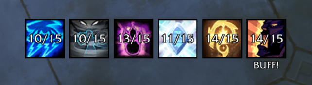

  

<h1 align="center">RaidBuffsTracker</h1>

  A lightweight World of Warcraft addon that tracks missing raid buffs with a clean icon display.

## Screenshots

  

  

## Features

- **Visual buff tracking** - Shows buff icons with count overlay (e.g., "17/20" = 17 buffed out of 20)
- **Auto-hide** - Icons disappear when everyone has the buff
- **Draggable frame** - Position anywhere on screen
- **Class reminder** - Shows "BUFF!" under your class's buff icon when party members are missing it
- **Customizable** - Adjust icon size, spacing, and text size

## Tracked Buffs

| Buff | Class |
|------|-------|
| Arcane Intellect | Mage |
| Power Word: Fortitude | Priest |
| Battle Shout | Warrior |
| Mark of the Wild | Druid |
| Skyfury | Shaman |
| Blessing of the Bronze | Evoker |

## Usage

Type `/rbt` to open the options panel where you can:
- Toggle which buffs to track
- Adjust icon size, spacing, and text size
- Lock/unlock frame position
- Show/hide the "BUFF!" reminder

## Notes

Due to WoW API limitations, the addon only works out of combat.

## License

MIT
